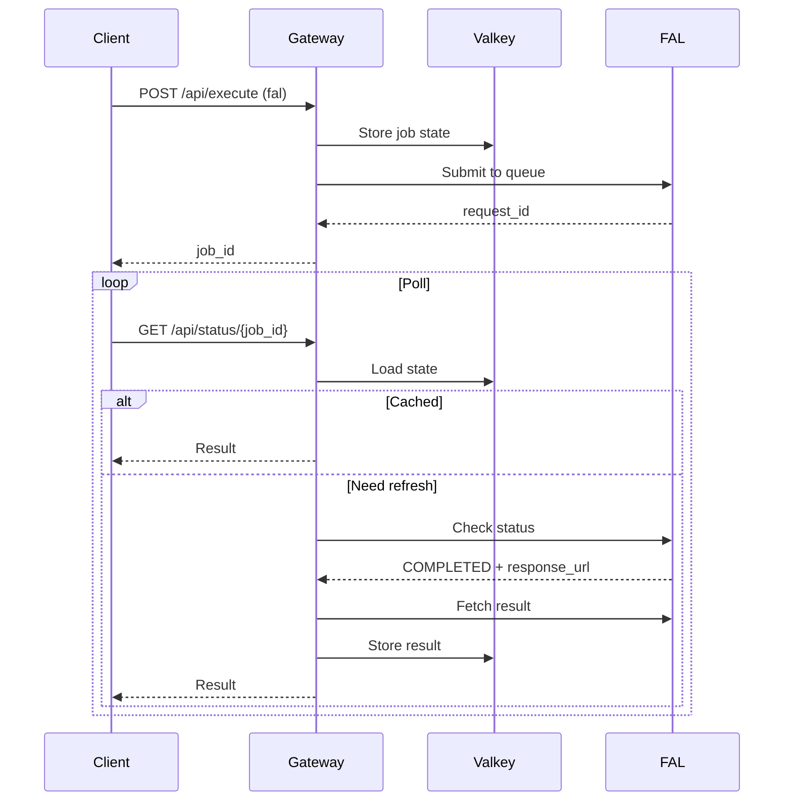

# FAL Gateway Integration

This document describes the FAL.ai media generation integration added to the OpenRouter Gateway.

## Client API reference (authoritative)

**To implement a client** (e.g. testopenrouter, MovieShaker, or any new app), use the full specification:

- **[docs/FAL_MEDIA_API.md](docs/FAL_MEDIA_API.md)** – Request/response shapes, authentication, step-by-step client flow, cURL examples, and troubleshooting.

The testopenrouter app is a reference client that validates this API; the doc above is the single source of truth for building API calls.

## Overview

The gateway now supports **two providers**:
1. **OpenRouter** - LLM text completion (existing)
2. **FAL** - Media generation (images, videos, audio) - NEW

## Architecture

### Provider Discrimination

Requests are routed based on the `provider` field using Pydantic discriminated unions:

```json
{
  "provider": "openrouter",
  "job_type": "text-completion",
  "payload": {...}
}
```

```json
{
  "provider": "fal",
  "media_type": "image-generation",
  "payload": {...}
}
```

### Async Job Pattern

FAL requests return immediately with a `job_id`. Clients poll `/api/status/{job_id}` until completion:



## API Endpoints

### POST /api/execute

**OpenRouter Request:**
```json
{
  "provider": "openrouter",
  "job_type": "text-completion",
  "payload": {
    "model": "gpt-4",
    "messages": [{"role": "user", "content": "Hello"}]
  },
  "dry_run": false
}
```

**FAL Request:**
```json
{
  "provider": "fal",
  "media_type": "image-generation",
  "model": "fal-ai/flux/schnell",  // Optional override
  "payload": {
    "prompt": "A beautiful sunset",
    "image_size": "square_hd",
    "num_images": 1
  },
  "dry_run": false
}
```

**FAL Response:**
```json
{
  "ok": true,
  "job_id": "uuid-here",
  "job_status": "processing",
  "status_url": "/api/status/uuid-here",
  "estimate": {
    "subtotal": 0.003,
    "admin_total": 0.0013,
    "total": 0.0043,
    "estimated": true,
    "pricing_version": "2026-01-22",
    "strategy": "per_megapixel"
  }
}
```

### GET /api/status/{job_id}

**Processing Response:**
```json
{
  "ok": true,
  "job_id": "uuid-here",
  "job_status": "processing",
  "provider_status": {
    "status": "IN_PROGRESS",
    "queue_position": 2
  }
}
```

**Completed Response:**
```json
{
  "ok": true,
  "job_id": "uuid-here",
  "job_status": "completed",
  "result": {
    "files": [
      {
        "url": "https://fal.media/files/...",
        "content_type": "image/jpeg",
        "width": 1024,
        "height": 1024
      }
    ],
    "raw": {...}
  },
  "usage": {
    "subtotal": 0.003,
    "total": 0.0043,
    "estimated": false
  }
}
```

**Failed Response:**
```json
{
  "ok": false,
  "job_id": "uuid-here",
  "job_status": "failed",
  "error": "FAL API error: ..."
}
```

## Supported Media Types

| Media Type | Default Model | Mode | Timeout |
|------------|---------------|------|---------|
| `image-generation` | `fal-ai/flux/schnell` | queue | 60s |
| `image-generation-hd` | `fal-ai/flux-pro` | queue | 120s |
| `image-to-video` | `fal-ai/kling-video/v1/standard/image-to-video` | queue | 300s |
| `video-generation` | `fal-ai/runway-gen3/turbo/image-to-video` | queue | 180s |
| `audio-generation` | `fal-ai/stable-audio` | queue | 120s |

## Model Allowlist (Correction #9)

Only models in the allowlist can be used. See `app/routing/media_routing.py`:

```python
ALLOWED_MODELS = {
    "fal-ai/flux/schnell",
    "fal-ai/flux/dev",
    "fal-ai/flux-pro",
    "fal-ai/kling-video/v1/standard/image-to-video",
    # ... more
}
```

To use a model override:
```json
{
  "provider": "fal",
  "media_type": "image-generation",
  "model": "fal-ai/flux-pro",  // Must be in ALLOWED_MODELS
  "payload": {...}
}
```

## Pricing Strategies

FAL models use different pricing strategies:

### Per-Megapixel (FLUX models)
```python
{
  "strategy": "per_megapixel",
  "cost_per_megapixel": 0.000003,
  "megapixels": 1.048,  // 1024x1024
  "num_images": 1
}
```

### Per-Second (Video models)
```python
{
  "strategy": "per_second",
  "cost_per_second": 0.08,
  "duration_seconds": 5
}
```

### Per-Generation (Audio, simple models)
```python
{
  "strategy": "per_generation",
  "cost_per_generation": 0.025,
  "num_generations": 1
}
```

## Critical Corrections Applied

### 1. Discriminated Union (Correction #1)
Uses Pydantic's discriminator to prevent request mis-routing based on `provider` field.

### 2. Async Valkey Client (Correction #2)
Uses `redis.asyncio` to avoid blocking the FastAPI event loop.

### 3. TTL-Only Locks (Correction #3)
Locks expire automatically via TTL, no explicit release needed.

### 4. Transient Error Handling (Correction #4)
Network errors during status checks don't fail the job, only terminal FAL errors do.

### 5. Response URL Validation (Correction #5)
- Host allowlist: `fal.run`, `fal.media`, `storage.googleapis.com`, etc.
- Auth header included when fetching results

### 6. TTL Refresh (Correction #6)
Job TTL is refreshed on every update to prevent premature eviction.

### 7. Field Consistency (Correction #7)
Uses `provider_request_id` consistently throughout.

### 8. Robust Result Parsing (Correction #8)
Handles multiple output formats: `images`, `videos`, `audio`, `audio_file`, etc.

### 9. Model Allowlist (Correction #9)
Prevents arbitrary expensive model access via allowlist.

### 10. Admin-Gated Logs (Correction #10)
`/api/logs` requires `ADMIN_API_KEY` (or falls back to `INTERNAL_API_KEY`).

## Environment Variables

See `.env.example` for full configuration.

**Required:**
- `INTERNAL_API_KEY`
- `OPENROUTER_API_KEY`
- `FAL_KEY`

**Optional:**
- `ADMIN_API_KEY` - For `/api/logs` endpoint
- `VALKEY_URL` - Default: `redis://valkey:6379/0`
- `JOB_TTL_SECONDS` - Default: `3600` (1 hour)

## Deployment

```bash
# 1. Copy environment file
cp .env.example .env

# 2. Edit .env with your keys
nano .env

# 3. Build and start services
docker-compose up -d --build

# 4. Check logs
docker-compose logs -f gateway
docker-compose logs -f valkey

# 5. Test health
curl http://localhost:8000/health
```

## Testing

### Dry Run (No FAL API Call)
```bash
curl -X POST http://localhost:8000/api/execute \
  -H "X-Internal-API-Key: your-key" \
  -H "Content-Type: application/json" \
  -d '{
    "provider": "fal",
    "media_type": "image-generation",
    "payload": {
      "prompt": "A beautiful sunset",
      "image_size": "square_hd"
    },
    "dry_run": true
  }'
```

### Actual Execution
```bash
# Submit job
JOB_ID=$(curl -X POST http://localhost:8000/api/execute \
  -H "X-Internal-API-Key: your-key" \
  -H "Content-Type: application/json" \
  -d '{
    "provider": "fal",
    "media_type": "image-generation",
    "payload": {
      "prompt": "A beautiful sunset",
      "image_size": "square_hd"
    },
    "dry_run": false
  }' | jq -r '.job_id')

# Poll status
while true; do
  STATUS=$(curl -s http://localhost:8000/api/status/$JOB_ID \
    -H "X-Internal-API-Key: your-key" | jq -r '.job_status')
  echo "Status: $STATUS"
  [ "$STATUS" = "completed" ] && break
  [ "$STATUS" = "failed" ] && break
  sleep 2
done

# Get final result
curl http://localhost:8000/api/status/$JOB_ID \
  -H "X-Internal-API-Key: your-key" | jq
```

## Monitoring

### Valkey Health
```bash
docker exec valkey-gateway valkey-cli ping
# Should return: PONG
```

### Job Inspection
```bash
# Connect to Valkey
docker exec -it valkey-gateway valkey-cli

# List all job keys
KEYS ms:job:*

# Inspect a job
HGETALL ms:job:uuid-here

# Check TTL
TTL ms:job:uuid-here
```

### Gateway Logs
```bash
# Requires ADMIN_API_KEY if set
curl http://localhost:8000/api/logs?lines=100 \
  -H "X-Internal-API-Key: your-admin-key"
```

## Troubleshooting

### Job Stuck in Processing
- Check FAL API status manually
- Verify `FAL_KEY` is valid
- Check Valkey connectivity
- Inspect job state in Valkey

### Valkey Connection Errors
```bash
# Check Valkey is running
docker ps | grep valkey

# Check network
docker exec openrouter-gateway ping valkey

# Check Valkey logs
docker logs valkey-gateway
```

### Model Not Allowed Error
Add model to `ALLOWED_MODELS` in `app/routing/media_routing.py`.

## Integration with MovieShaker

MovieShaker should:
1. Submit FAL job via `/api/execute`
2. Poll `/api/status/{job_id}` until `job_status=completed`
3. Extract file URLs from `result.files[].url`
4. Download files from FAL URLs
5. Upload to Digital Ocean Spaces
6. Clean up temporary FAL files if needed

**Note:** Gateway does NOT handle file uploads. It only returns URLs.
